# 🎓 College Project & Seminar Roadmap

  <strong><em>The guide we wish we had when we were in 3rd year.</em></strong>

---

It's 11 PM. Your submission is tomorrow. The code works on your laptop but crashes on your teammate's. The report is 40 pages short. Your guide hasn't replied to your email in three days. Sound familiar?

**We've been there.** Every. Single. One. Of. Us.

This roadmap isn't written by professors in ivory towers. It's written by students who survived the chaos of CSE projects—and want to help you do the same, with fewer tears and maybe even a good grade.

---

## 🗺️ What's Inside?

### 🛠️ [Mini Project](./mini-project/)
*Your first taste of building something real.*
- Choosing a topic that isn't the 500th "Library Management System."
- Rapid prototyping without over-engineering.
- Writing a report that actually gets approved.

### 🚀 [Main Project](./main-project/)
*The final boss of your B.Tech.*
- **Phase 1:** How to write a synopsis that doesn't get rejected (again).
- **Phase 2:** Building the system and surviving the "90% done" trap.
- **Report:** Cracking the 100+ page thesis.
- **Viva:** Facing the external examiner without having a panic attack.

### 🎤 [Technical Seminar](./seminar/)
*Present like an engineer, not a reader.*
- Picking topics that aren't "dead" (hint: skip basic Bluetooth).
- Explaining "inner workings," not just high-level summaries.
- The one question you MUST ask your seminar guide before you start.

### 🍱 [Team & Soft Skills](./resources/team-dynamics.md)
*Because a bad team can ruin a great idea.*
- The 4 archetypes of project teams (including "The Ghost Teammate").
- Why you shouldn't pick friends over workers.
- "I'll carry them" and other lies we tell ourselves.

### 💡 [Resources & Confessions](./resources/)
- Project ideas that are actually impressive.
- Scoring strategies the toppers won't share.
- **[Student Confessions](./resources/confessions.md)**: Real stories of failure and redemption. *The most relatable page on this site.*

---

## 🎯 Our Goal

To bridge the gap between "just getting it done" and "building something you're proud to put on your resume."

Walk out of your final Viva not just with an 'A' grade, but with a project you'd actually show a recruiter.

---

!!! quote "A Senior Once Said..."
    *"The earlier you start, the better your project will be. But you won't listen to this advice. Nobody does. See you at 11 PM the night before the deadline."*

---

## 📈 The Journey (Visualized)

```mermaid
graph TD
    A[😴 Start] --> B[💡 Ideation]
    B --> C{Topic Approved?}
    C -- No --> B
    C -- Yes --> D[📋 Phase 1: Planning]
    D --> E[💻 Phase 2: Execution]
    E --> F{Bugs?}
    F -- Yes, Always --> E
    F -- Somehow No --> G[📄 Documentation]
    G --> H[🎤 Viva]
    H --> I[🎉 Freedom!]
```

